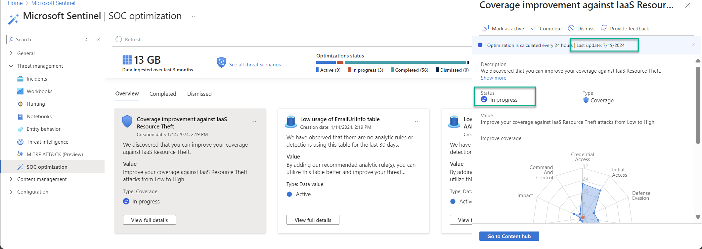

# PowerShell Module for Microsoft SOC Optimization API


PowerShell Module for Microsoft SOC optimization API

This PowerShell Module contains PowerShell functions to interact with the Microsoft SOC Optimization API.

## Module Functions

The PSMDSOCOptimization **PowerShell Module** includes the following fuctions:

| Function | Description  |
| ----------------------- | -------------------------------------------------------------------------------------- |
| Get-MDSOCRecommendations | Retrieves the SOC Optimization recommendations |
| Update-MDSOCRecommendation | Updates the State of the recommendation or triggers a reevaluation |

## Initial Setup and Configuration

1. Register a Microsoft Entra application and record its application ID.
2. Generate and record a client secret for your Microsoft Entra application.
3. Assign your Microsoft Entra application the Microsoft Sentinel contributor role or equivalent.
4. Until the Module is available in the PowerShell Gallery, download the module from the *module* folder and copy the module into your PowerShell module folder.

Prepare a script as shown below and fill in the parameter variables.

## Examples

Retrieve all the recommendations

```powershell
# Import the module
Import-Module -Name "PSMDSOCoptimization" -Force

# ---------------------------------------------------------------------------------- #
# Define the variables for the function
# ---------------------------------------------------------------------------------- #
$AppId = ''
$AppSecret = ''
$TenantName = "demo.OnMicrosoft.com"
$WorkspaceName = ""
$ResourceGroupName = ''
$SubscriptionId = ""

# ---------------------------------------------------------------------------------- #
# Retrieve the recommendations
# ---------------------------------------------------------------------------------- #
$recommendations = Get-MDSOCRecommendations -AppId $AppId -AppSecret $AppSecret -TenantName $TenantName -WorkspaceName $WorkspaceName -ResourceGroupName $ResourceGroupName -SubscriptionId $SubscriptionId
$recommendations

```

Below is an example of the expected output per recommendation

```PowerShell
$recommendations[5]

Id                   : <intentionally removed>
name                 : b86a5814-2b5b-4b2f-95e1-64261ebaa675
RecommendationId     : b86a5814-2b5b-4b2f-95e1-64261ebaa675
type                 : Microsoft.SecurityInsights/Recommendations
properites           : @{recommendationTypeId=Precision_Coverage; state=InProgress; title=Coverage improvement against IaaS Resource Theft; description=We discovered that you can improve 
                       your coverage against IaaS Resource Theft.; creationTimeUtc=2024-01-14T13:19:39.0613485+00:00; lastEvaluatedTimeUtc=2024-07-19T07:30:35.0632979+00:00; 
                       lastModifiedTimeUtc=2024-07-19T07:29:38.6163869+00:00; suggestions=System.Object[]; additionalProperties=}
state                : InProgress
title                : Coverage improvement against IaaS Resource Theft
description          : We discovered that you can improve your coverage against IaaS Resource Theft.
creationTimeUtc      : 2024-01-14T13:19:39.0613485+00:00
lastEvaluatedTimeUtc : 2024-07-19T07:30:35.0632979+00:00
lastModifiedTimeUtc  : 2024-07-19T07:29:38.6163869+00:00
suggestions          : {@{suggestionTypeId=Precision_Coverage_ImproveCoverage; title=Improve coverage; description=Improve your coverage against IaaS Resource Theft attacks from Low to 
                       High.; action=Go to content hub and add 83 new analytic rules. You can also create your own rule to achieve the recommended level of coverage.; 
                       additionalProperties=}}
additionalProperties : @{UseCaseId=attackscenario--7038e587-af8c-4189-8733-1193b5af0607; UseCaseName=IaaS Resource Theft}
```

Change the status of a recommendation

Use the **State** parameter with one of the following values: ***Active, InProgress, Dismissed, CompletedByUser, CompletedBySystem***

```powershell
$recommendationId = "b86a5814-2b5b-4b2f-95e1-64261ebaa675"
Update-MDSOCRecommendation -State InProgress  -Id $recommendationId -AppId $AppId -AppSecret $AppSecret -TenantName $TenantName -WorkspaceName $WorkspaceName -ResourceGroupName $ResourceGroupName -SubscriptionId $SubscriptionId
```

Trigger a reevaluation for the recommendation

Use the **Reevaluation** parameter.

```powershell
$recommendationId = "b86a5814-2b5b-4b2f-95e1-64261ebaa675"
Update-MDSOCRecommendation -Reevaluation -Id $recommendationId -AppId $AppId -AppSecret $AppSecret -TenantName $TenantName -WorkspaceName $WorkspaceName -ResourceGroupName $ResourceGroupName -SubscriptionId $SubscriptionId
```



## References

- [SOC optimization: unlock the power of precision-driven security management](https://techcommunity.microsoft.com/t5/microsoft-sentinel-blog/soc-optimization-unlock-the-power-of-precision-driven-security/ba-p/4130589)
- [Optimize your security operations](https://learn.microsoft.com/en-us/azure/sentinel/soc-optimization/soc-optimization-access?tabs=azure-portal)
- [Introducing SOC Optimization API](https://techcommunity.microsoft.com/t5/microsoft-sentinel-blog/introducing-soc-optimization-api/ba-p/4176966)
- [API versions of Microsoft Sentinel REST APIs](https://learn.microsoft.com/en-us/rest/api/securityinsights/api-versions?view=rest-securityinsights-2024-03-01)
